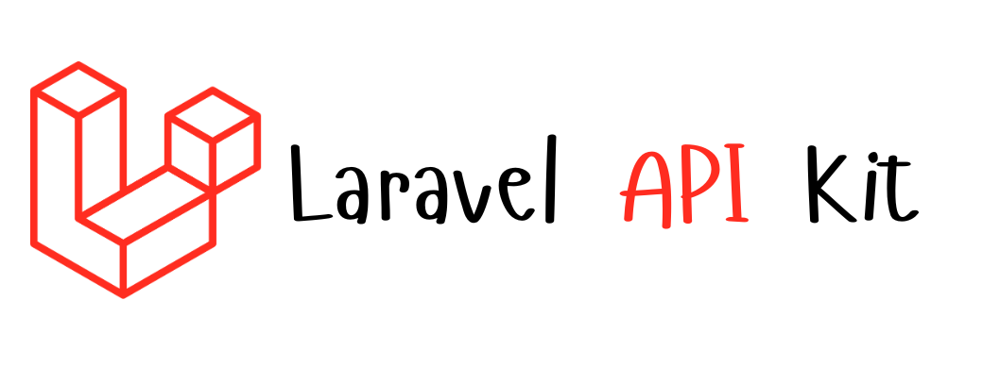

<h1 align="center">LaravelAPIKit</h1>

<p align="center">
  
</p>

**LaravelAPIKit** is a package designed to enhance your Laravel application's API capabilities. It provides standardized JSON responses, streamlined exception handling, customizable data transformers, and custom request validation. The package also includes helpful artisan commands to automate the creation of transformers and custom requests, making API development faster and more efficient.

## Features

- **Custom JSON Standardized Response Trait**
  Easily return consistent JSON responses for API endpoints, including success, error, and various HTTP status codes.

- **Exception Handling**
  A dedicated exception handler that converts common exceptions (such as model not found, validation errors, etc.) into standardized JSON responses.

- **Data Transformer**
  Simplify the transformation of models or other data structures for API responses.

- **Custom Requests**
  Create custom request validation logic to handle incoming API requests with ease.

- **Artisan Commands**
  - `php artisan make:transformer ClassName` – Quickly generate a transformer class.
  - `php artisan make:request ClassName` – Easily generate a custom request class.

## Installation

To install the LaravelAPIKit package in your Laravel project, follow these steps:

1. Install via Composer:

    ```bash
    composer require haxneeraj/laravel-api-kit
    ```

2. Add the service provider to the `config/app.php` file (this step may be optional if you're using Laravel's package auto-discovery):

**For Laravel 10 and below:**

    'providers' => [
        // Other service providers...
        Haxneeraj\LaravelAPIKit\LaravelAPIKitServiceProvider::class,
    ],
**For Laravel 11:**
Add the service provider to the `bootstrap/providers.php` file (this step may be optional if you're using Laravel's package auto-discovery):

    return [
        App\Providers\AppServiceProvider::class,
        Haxneeraj\LaravelAPIKit\LaravelAPIKitServiceProvider::class,
    ];

## Configuration

### 1. Publish the Configuration File

LaravelAPIKit provides a configuration file that allows you to customize how the package behaves. To publish the configuration file, run the following command:

    php artisan vendor:publish --provider="Haxneeraj\LaravelAPIKit\LaravelAPIKitServiceProvider" --tag=config

This will publish a laravel-api-kit.php file in your config directory, where you can set things like the exception handling mode (e.g., dev_mode = true/false/'dev'). Customize the configuration file to suit your needs.

You can set the exception handling mode in the .env file so that other parts of the package use the same mode:

    HAX_DEBUG_MODE = true/false/'dev'

  - true — Returns the message with the exception message.
  - false — Returns the message with the user-defined message.
  - 'dev' — Returns the message with the exception message and stack trace.

### 2. Publish Translations

LaravelAPIKit also comes with translatable strings that you can modify. To publish these translations, run:

    php artisan vendor:publish --provider="Haxneeraj\LaravelAPIKit\LaravelAPIKitServiceProvider" --tag=lang

You can now customize the translation files in `resources/lang/haxneeraj/laravel-api-kit/`.

 Usage

    __('LaravelAPIKit::message.not_found')

<hr />

# 1. JSON Standardized Response Trait

Use the `APIResponseTrait` in your controllers to standardize the API responses. This trait provides methods for returning success or error responses, including custom messages and HTTP status codes.

 Example:

    use Haxneeraj\LaravelAPIKit\Traits\APIResponseTrait;

    class ExampleController extends Controller
    {
        use APIResponseTrait;

        public function index()
        {
            return $this->response(true, 'Data fetched successfully', ['key' => 'value']);
        }
    }
## Methods

 ***`response($status = true, $message = '', $data = [], $errors = [], $code = Response::HTTP_OK): JsonResponse`***

- **Description:** General method to return a JSON response.
- **Parameters:**
  - `bool $status` - The status of the response (true for success, false for error).
  - `string $message` - A message providing more context about the response.
  - `array $data` - The data to be returned with the response.
  - `array $errors` - Any errors associated with the response.
  - `int $code` - The HTTP status code for the response.
- **Returns:** `JsonResponse`

 Example:

    return $this->response(true, 'Data fetched successfully', $data);

    // return with custom HTTP status code
    return $this->response(false, 'Error', [], ['error' => 'Something went wrong'], Response::HTTP_BAD_REQUEST);

    //return only success message
    return $this->response(true, 'Data fetched successfully');

    // return only error message
    return $this->response(false, 'Something went wrong');

***`responseCreated(?string $message = null, array $data = []): JsonResponse`***

- **Description:** Respond with a 201 Created status.
- **Parameters:**
  - `string|null $message` - The success message for the created resource.
  - `array $data` - The data of the created resource.
- **Returns:** `JsonResponse`

***`responseDeleted(?string $message = null): JsonResponse`***

- **Description:** Respond with a 204 No Content status, typically used after a resource is deleted.
- **Parameters:**
  - `string|null $message` - The success message for the deleted resource.
- **Returns:** `JsonResponse`

***`responseNotFound(?string $errorTitle = null, mixed $errorDetails = null): JsonResponse`***

- **Description:** Respond with a 404 Not Found status.
- **Parameters:**
  - `string|null $errorTitle` - The title of the error.
  - `mixed $errorDetails` - Detailed information about the error (can be an array or other types).
- **Returns:** `JsonResponse`

***`responseBadRequest(?string $errorTitle = null, mixed $errorDetails = null): JsonResponse`***

- **Description:** Respond with a 400 Bad Request status.
- **Parameters:**
  - `string|null $errorTitle` - The title of the error.
  - `mixed $errorDetails` - Detailed information about the error (can be an array or other types).
- **Returns:** `JsonResponse`

***`responseUnAuthorized(?string $errorTitle = null, mixed $errorDetails = null): JsonResponse`***

- **Description:** Respond with a 403 Forbidden status.
- **Parameters:**
  - `string|null $errorTitle` - The title of the error.
  - `mixed $errorDetails` - Detailed information about the error (can be an array or other types).
- **Returns:** `JsonResponse`

***`responseConflictError(?string $errorTitle = null, mixed $errorDetails = null): JsonResponse`***

- **Description:** Respond with a 409 Conflict status.
- **Parameters:**
  - `string|null $errorTitle` - The title of the error.
  - `mixed $errorDetails` - Detailed information about the error (can be an array or other types).
- **Returns:** `JsonResponse`

***`responseUnprocessable(?string $errorTitle = null, mixed $errorDetails = null): JsonResponse`***

- **Description:** Respond with a 422 Unprocessable Entity status, commonly used for validation errors.
- **Parameters:**
  - `string|null $errorTitle` - The title of the error.
  - `mixed $errorDetails` - Detailed information about the error (can be an array or other types).
- **Returns:** `JsonResponse`

***`responseUnAuthenticated(?string $errorTitle = null, mixed $errorDetails = null): JsonResponse`***

- **Description:** Respond with a 401 Unauthorized status when authentication fails or is not provided.
- **Parameters:**
  - `string|null $errorTitle` - The title of the error.
  - `mixed $errorDetails` - Detailed information about the error (can be an array or other types).
- **Returns:** `JsonResponse`

## Example Usage

```php
use Haxneeraj\LaravelAPIKit\Traits\APIResponseTrait;

class ExampleController extends Controller
{
    use APIResponseTrait;

    public function index()
    {
        return $this->response(true, 'Data fetched successfully', ['key' => 'value']);
    }

    public function store(Request $request)
    {
        $user = User::create([
            //data
        ]);
        return $this->responseCreated('Resource created successfully', $user);
    }

    public function delete(User $user)
    {
        $user->delete();
        return $this->responseDeleted('Resource deleted successfully');
    }
}
```

# 2. Exception Handling

The package provides a dedicated exception handler that converts common exceptions (such as model not found, validation errors, etc.) into standardized JSON responses. Extend our exception handler to customize the behavior or add additional exception handling logic.

 Exception Handler

    use Haxneeraj\LaravelAPIKit\Exceptions\ApiException;

    class Handler extends ApiException
    {
        try
        {
            //
        }
        catch(\Exception $e)
        {
            return $this->handle($e);
        }
    }

### Note: The `ApiException` class used the `APIResponseTrait` Trait so you don't need to import it.

Or You Can Make a Common Class for All API Controllers and Extend it.

    use Haxneeraj\LaravelAPIKit\Exceptions\ApiException;

    class ApiController extends ApiException
    {
        //
    }

and in your controllers extends it.

    use App\Http\Controllers\ApiController;

    class ExampleController extends ApiController
    {
        //
    }

Other way to use it as object.

    use Haxneeraj\LaravelAPIKit\Exceptions\ApiException;

    class ExampleController extends Controller
    {
        public function __construct()
        {
            $this->apiException = new ApiException();
        }

        public function index()
        {
            try
            {
                //
            }
            catch(\Exception $e)
            {
                return $this->apiException->handleException($e);
                // or you can call the method statically. - return ApiException::handleException($e);
            }
        }
    }
### Note: In this case, if you want to use the `APIResponseTrait` Trait in your controller, you need to import it.


# 3. Data Transformer

The package provides a data transformer that simplifies the transformation of models or other data structures for API responses. Use the following artisan command to create a new transformer class:

    php artisan make:transformer UserTransformer

    //Or want to give a directory structure then
    php artisan make:transformer User/Usertransformer

The transformer class will be generated in the `app/Transformers` directory.

 Transformer Class

    use Haxneeraj\LaravelAPIKit\Transformers\LaravelAPIKitTransformer;

    class UserTransformer extends LaravelAPIKitTransformer
    {
        public function model($user)
        {
            // you can use $user->id, $user->name, $user->email, etc.
            return [
                //'id' => $user->id,
                //'name' => $user->name,
                //'email' => $user->email,
            ];
        }
    }


### Use Case

    use App\Transformers\UserTransformer;
    use App\Http\Controllers\APIController;

    class UserController extends APIController
    {
        public $transformer;

        public function __construct(UserTransformer $transformer)
        {
            $this->transformer = $transformer;
        }

        public function index()
        {
            $users = User::all();
            return $this->response(true, 'Users fetched successfully', $this->transformer->transform($users));
        }
    }

# 4. Custom Requests

The package provides a custom request class that allows you to create custom request validation logic to handle incoming API requests with ease. Use the following artisan command to create a new request class:

    php artisan make:request ExampleRequest

    // or use the directory structure
    php artisan make:request Example/ExampleRequest

The Request class will be generated in the `app/Http/Requests` directory.

 ExampleRequest Class

    use Haxneeraj\LaravelAPIKit\Http\Requests\LaravelApiKitRequest;

    class ExampleRequest extends LaravelApiKitRequest
    {
        /**
        * Determine if the user is authorized to make this request.
        */
        public function authorize(): bool
        {
            return true;
        }

        /**
        * Get the validation rules that apply to the request.
        *
        * @return array<string, \Illuminate\Contracts\Validation\Rule|array|string>
        */
        public function rules(): array
        {
            return [
                //
            ];
        }
    }


# License

The LaravelAPIKit package is open-sourced software licensed under the [MIT license](LICENSE).

 Contributing

Contributions are welcome and greatly appreciated. Please check out the [contribution guidelines](CONTRIBUTING.md) for more information.

 Credits

**Author:** Neeraj Saini
**Email:** [hax-neeraj@outlook.com](mailto:hax-neeraj@outlook.com)
**GitHub:** [https://github.com/haxneeraj/](https://github.com/haxneeraj/)
**LinkedIn:** [https://www.linkedin.com/in/hax-neeraj/](https://www.linkedin.com/in/hax-neeraj/)

**Twitter:** [https://x.com/hax_neeraj/](https://x.com/hax_neeraj/)

- [All Contributors](../../contributors)
